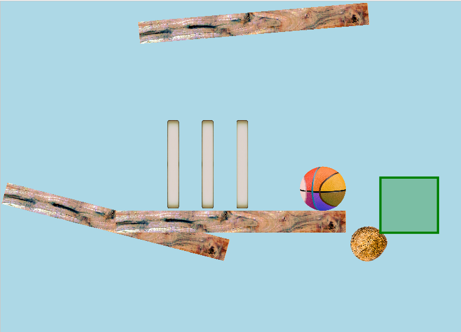

# Mad Machines




## What is this all about?

Mad Machines is a small university project made by Nora Albrecht, Temur Naimat, Felix Moeller and khut in accordance with the Software Engineering Practicum CS2301 by the University of Luebeck.

Mad Machines a fun game with a simple physics engine where the player has to beat multiple levels by using building blocks in order to control the flow of a ball. Goal is to kick off a specific box by cleverly placing the given resources. This game challenges the players creativity, problem solving skills, understanding of the game mechanics as well as the developers ability to design an engaging, functional game.

## Fast travel the Doc

* [User Guide](#guide)
* [Captains Log](#captains-log)
* [How it works](#how-it-works)

## Guide

### Installation

Make sure you have [JDK 11](https://openjdk.org/projects/jdk/11/) and [maven](https://maven.apache.org/) installed.

Clone the repository and execute

`mvn javafx:run`

to run.

### Usage

From here, the main menu shows and you can play the game :)
the "help" button will help you getting started

## Useful Commands

Overview of useful Maven-Commands

* `mvn clean` deletes all built files
* `mvn compile` compiles game from code
* ~~`mvn javafx:jlink` packt den gebauten Code als modulare Laufzeit-Image. Das Projekt kann danach gestartet werden mit `target/dhl/bin/dhl`~~
* `mvn test` executes tests
* `mvn compile site` compiles code, documentation, tests and executes all tests, JaCoCo and PMD, including CPD. The file `target/site/index.html` gives an overview over all reports.
* `mvn javafx:run` starts game
* `mvn javafx:run -Dargs="--no-gui"` starts game with command-line-parameter `--no-gui`.

## Support

Issues can be created on this repository.

## Captains Log

### sanity checks

* has cloned repo ✅✅✅✅
* has built, compiled and executed with maven ✅✅✅✅
* has familiarized with javaFX, jbox2 ✅✅✅✅
* has basic understanding of game flow ✅✅✅✅

### blast off

* collected requirements (Story Cards?) ✅
* analyzed milestones, time management, optional goals ✅
* established division of focus, dev cycle ✅

### Roles

* Head Dev: Nora Albrecht
* Testing/Documentation: Felix Moeller
* GUI Architecture: Temur Naimat
* Graphical Design: khut

### Requirements

given:

* **have an App** ✅
* different views ✅
* physics objects ✅
* objects placable from container ✅
* loading levels ✅
* puzzles ✅
* rendered graphics ✅
* win conditions -> zones ✅
* main and selection menu ✅
* more objects ✅
* headless mode ❌
* expanded editor ✅
* better graphics ✅
* **complete game** ✅

### Story Cards

* A user wants to design levels, solve puzzles and watch the result happen  
  * Estimated Effort: High

* A user wants to save and load created levels  
  * Estimated Effort: Medium

* A user wants to know what he can and cannot do, and when he has won  
  * Estimated Effort: Medium

* A user wants to place objects in different positions  
  * Estimated Effort: Medium

* A dev wants to quickly understand how the code works  
  * Estimated Effort: Low

* A dev wants to easily create and modify the existing game  
  * Estimated Effort: Medium

* A dev wants to see no excessive hardware usage  
  * Estimated Effort: Low

### Milestones

the goal is to finish most of the milestone for the next submission already, leaving ample time

#### Release 0: Pre-Alpha

* research ✅
* establish workflow ✅
* create new hierarchy for App (javafx) ✅
* create working physics sim (jbox2d) ✅
* design level data format ✅

#### Release 1: Alpha Requirements

* merge to gui to main ✅
* add css integration ✅
* write basic documentation ✅
* add user privileges ❌
* implement set special object (rope, balloon ✅, anchor)
* integrate elements into gui selection menu ✅
* add win conditions ✅
* first test classes (✅)
* merge to alpha ✅

#### Release 2: Beta (finished game)

* switch level selection from images to renderPreview ✅
* fullscreen mode ✅
* help screen ✅
* additional features ✅
* expand testing ✅

#### Release 3: Prettify

* nice graphics ✅
* finish postponed milestones ✅
* write user information ✅
* trim some edges ✅
* add lore ✅

## How it Works

The game is run inside of JavaFX and its UI Engine and follows a modified model-view-controller pattern.
While especially the call hierarchy may be un-intuitive at first, calling java directly from fxml
leads to better responsiveness.

For those not familiar with CS jargon, we somehow need to have a program we can interact with
and want to recieve immediate feedback (e.g. graphical updates)
So we need a core process (provided by javaFX) that checks for user input, here this is happening
in form of mouse clicks. The main interactions are a) the buttons (via fxml) and b) the machine parts you can place.
Next is the "organizing stuff", keeping tabs on certain game elements, checking that no rules are violated etc.
Then there is "the game", meaning the physics used to simulate what happens next, which gets activated via clicking "start" and finally there must be a way to convert numbers in an array into the image of a ball the player can see.
To keep this flexible, we render all objects on a canvas, which allows resizing etc without
breaking (or worse, crashing) the game.

controller folder:
For those familiar with the more technical stuff, broadly there are Controller classes for every window,
from main menu to help screen, with GameWindow.java being responsible for the actual level. (the c in m-v-c pattern)

view folder:
View class is the graphical representation used to render all the objects  

model folder:
The GameScene.java is the central class of this folder, this is where all the cool stuff is happening. The other classes  are either Interfaces/abstract classes or provide the specific behaviors for all the placable objects.

level folder:
almost completely about loading levels from json (and saving active levels in json format)

### Terminology

| Term              | Description           | Comment                                   |
|-------------------|-----------------------|-------------------------------------------|
| javafx            | ui library            |                                           |
| jbox2d            | physics library       |                                           |
| App               | the process you run   | start with mvn javafx:run                 |
| Window            | javafx stage          | primary container for rendering           |  
| Scene             | inside current stage  | contains the to-be-rendered level         |
| View              | paints canvas         |                                           |
| PhysicalGameObject| objects used in Scene | regular objects like planks and balls     |
| SpecialGameObject | special objects       | like Ropes or zones                       |
| Story Mode        | solve tricky puzzles  | you get there by clicking "start"         |
| Sandbox Mode      | create/modify levels  | you can save and play them afterwards     |

### Call Hierarchy

```txt
App.java
    +-uses-> app.css
    +-starts-> Stage <-is-> Window
                +-starts-> Scene <-is-> startscreen.fxml
                            +-changes-> LevelSelectScreen.fxml
                                        +-creates-> GameWindow <-from- JSON-Level
                                                    +-new-> GameScene <-renders- View 
```

keep in mind that often a java class loads fxml which in turn uses other java classes(!)

### Disclaimer

To be efficient in our efforts, we generally tried to hold to general software engineering principles,
but deviated when we felt it was necessary. During the process, we followed **agile** principles,
creating what we already could at the time and trying to manage bottlenecks other tasks are dependent on.

While "getting familiar with how big dev teams operate" is most certainly one of the goals,
this game is - ultimately - not on the same scope as those GB-big libraries and highly complex tools,
so not choosing inappropriate standards is the prudent thing to do.

For us, the actual product was always the center focus, with readability second and code resilience third,
which may lead to some future bugs or inconsistencies, we very much depend on future users
to provide feedback and bug reports :)

## License

The code is licensed under the MIT license, the assets (all sprites and sounds) are licensed under [CC-BY-SA](https://creativecommons.org/licenses/by-sa/4.0/deed.en)

The font ZeroCool by [GGBotNet](https://www.ggbot.net/) is licensed under the [SIL Open Font License, Version 1.1](https://openfontlicense.org/).
